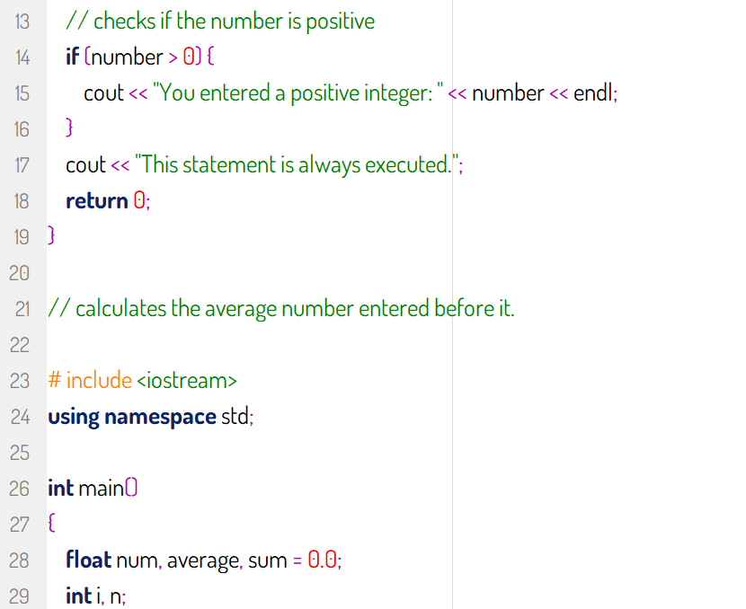
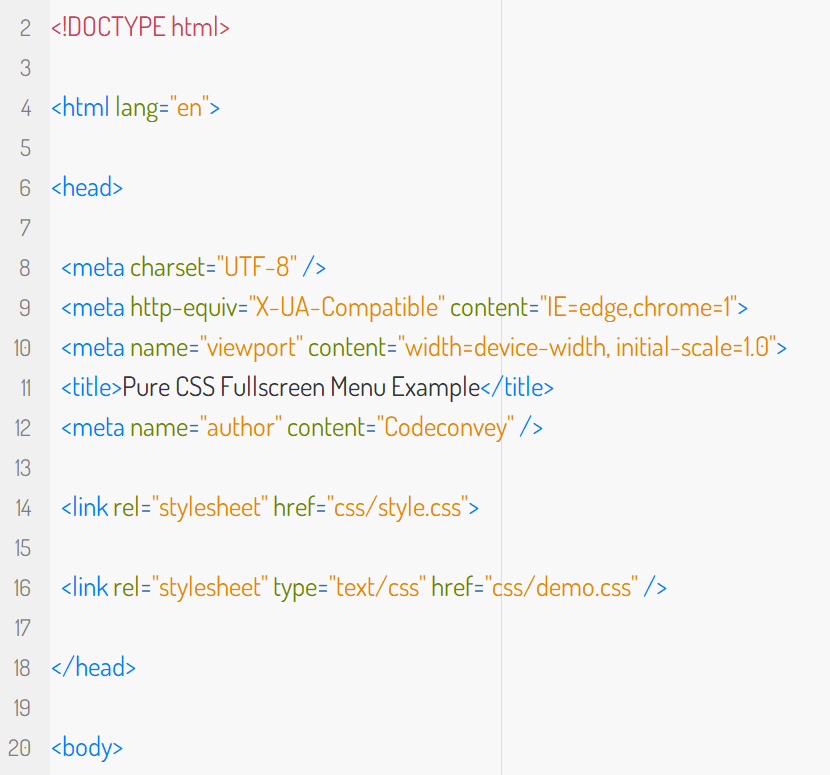
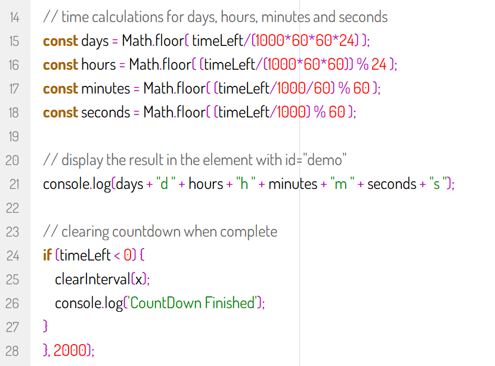
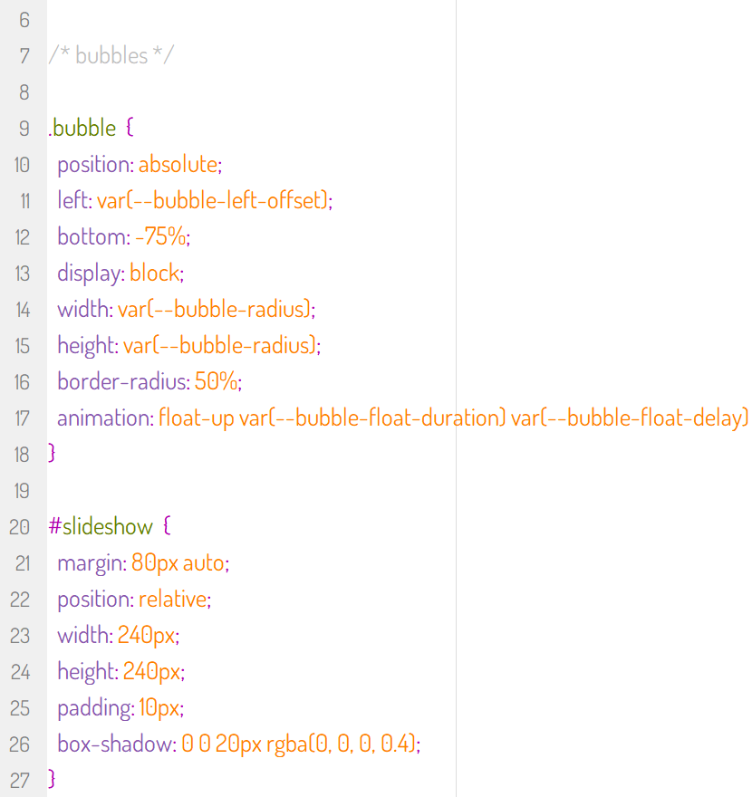

### Creme colorscheme for Notepad2

Light color scheme from [Alpen](https://github.com/yojeero/alpen_sublime) or [Cream](https://github.com/yojeero/cream_vscode) themes.

`
PHP
`   
   

`
C++
`   
 

`
HTML
`   
   

`
JS
`   
   

`
CSS
`   
 

### Downloads

You can download portable Notepad2 folder with Cream color scheme and copy folder in C:\Program Files\ or any destination.

### Or installing only config in Notepad2

1. Open the "Customize Schemes" window (Control-F12)
2. Import the `notepad2_cream.ini` file
3. Save your settings (F7)

### Fonts

In preview used Dosis-Regular.ttf from Notepad2.zip, Hack-Regular.ttf also included.
You can use any other font you like.

### Add context menu entry in Windows

You can run Notepad2.bat for create context menu entry in Windows Explorer if copy folder in C:\Program Files\ or any destination and edit paths.   

```
@echo off
SET st3Path=C:\Program Files\Notepad2\Notepad2e.exe

rem add it for all file types
@reg add "HKEY_CLASSES_ROOT\*\shell\Notepad2" /t REG_EXPAND_SZ /v "" /d "Notepad2"   /f
@reg add "HKEY_CLASSES_ROOT\*\shell\Notepad2" /t REG_EXPAND_SZ /v "Icon" /d "%st3Path%,0" /f
@reg add "HKEY_CLASSES_ROOT\*\shell\Notepad2\command" /t REG_EXPAND_SZ /v "" /d "%st3Path% \"%%1\"" /f
 
rem add it for right click on explorer
@reg add "HKEY_CLASSES_ROOT\Directory\shell\Notepad2" /t REG_EXPAND_SZ /v "" /d "Notepad2"   /f
@reg add "HKEY_CLASSES_ROOT\Directory\shell\Notepad2" /t REG_EXPAND_SZ /v "Icon" /d "%st3Path%" /f
@reg add "HKEY_CLASSES_ROOT\Directory\shell\Notepad2\command" /t REG_EXPAND_SZ /v "" /d "%st3Path% \"%%V\"" /f 

rem add it for right click on explorer
@reg add "HKEY_CLASSES_ROOT\Directory\Background\shell\Notepad2" /t REG_EXPAND_SZ /v "" /d "Notepad2"   /f
@reg add "HKEY_CLASSES_ROOT\Directory\Background\shell\Notepad2" /t REG_EXPAND_SZ /v "Icon" /d "%st3Path%" /f
@reg add "HKEY_CLASSES_ROOT\Directory\Background\shell\Notepad2\command" /t REG_EXPAND_SZ /v "" /d "%st3Path% \"%%V\"" /f
pause
```   